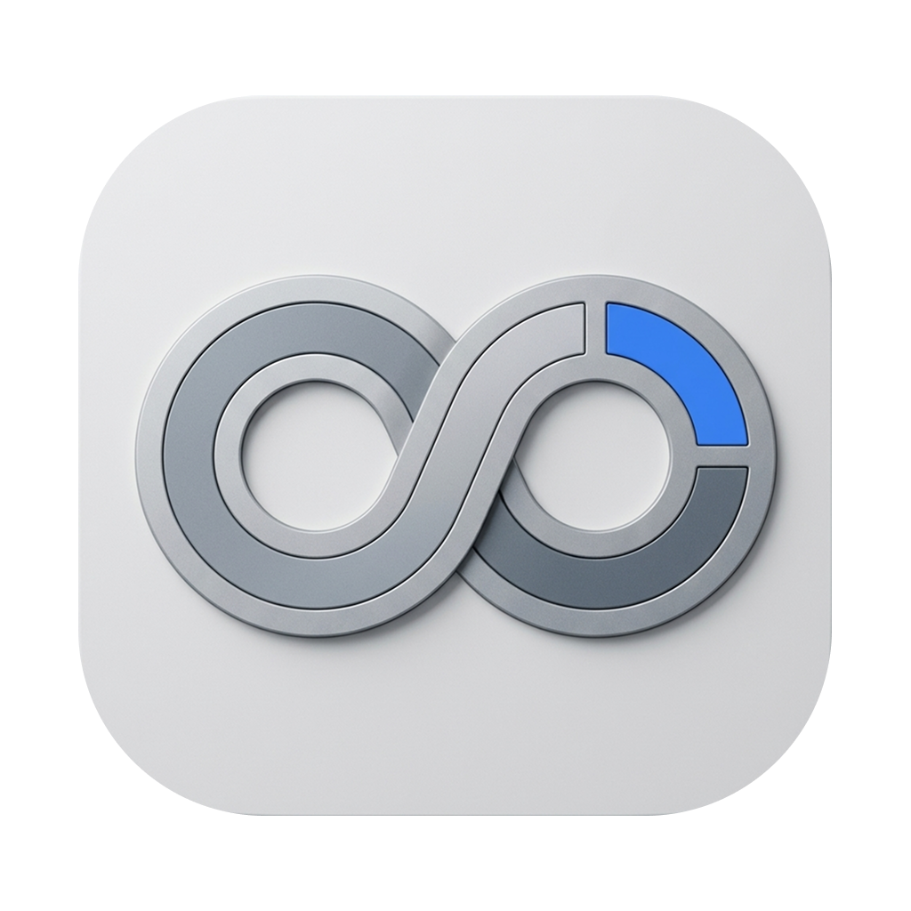
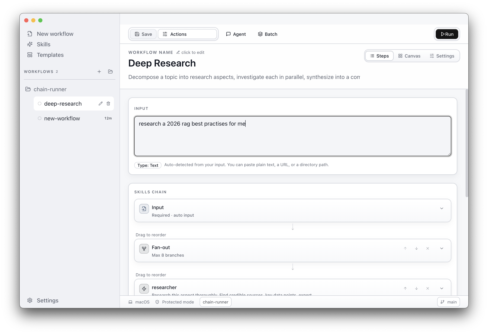

<p align="center">
  
</p>

<h3 align="center">c8c — skill operations for Claude Code</h3>

<p align="center">
  <a href="#quickstart"><strong>Quickstart</strong></a> &middot;
  <a href="https://github.com/bluzir/c8c"><strong>GitHub</strong></a>
</p>

<p align="center">
  <a href="https://github.com/bluzir/c8c/blob/main/LICENSE"></a>
  <a href="https://github.com/bluzir/c8c/stargazers"></a>
  
  
</p>

<br/>

## What is c8c?

# Open-source skill operations for Claude Code and OpenAI Codex

> One agent is a worker. c8c is a factory.

c8c is a desktop app that lets you build visual pipelines from Claude Code and OpenAI Codex skills. Chain, branch, evaluate, and retry — turn single prompts into production operations.

It looks like Apple Shortcuts — but under the hood it has directed graphs, evaluator gates, parallel branches, and cost tracking.

|        | Step               | Example                                                                       |
| ------ | ------------------ | ----------------------------------------------------------------------------- |
| **01** | Pick your skills   | Summarize, translate, code-review, fact-check — any Claude Code skill.        |
| **02** | Wire the pipeline  | Connect nodes on a visual canvas. Add evaluators, splitters, approval gates.  |
| **03** | Run it             | Hit run. Watch data flow through every node. See tokens, cost, time — live.   |

<div align="center">
<table>
  <tr>
    <td align="center"><strong>Works<br/>with</strong></td>
    <td align="center">⌘<br/><sub>Claude Code</sub></td>
    <td align="center">⌘<br/><sub>Codex CLI</sub></td>
    <td align="center">⌘<br/><sub>Claude SDK</sub></td>
  </tr>
</table>
<em>If it speaks to an LLM, it's a node.</em>
</div>

<p align="center">
  
</p>

<br/>

## c8c is right for you if

- ✅ You use **Claude Code or OpenAI Codex** and want to chain skills into repeatable workflows
- ✅ You **copy-paste outputs** between Claude conversations manually
- ✅ You want **evaluator loops** — retry until the output meets your quality bar
- ✅ You want to **see what's happening** at every step, not just the final answer
- ✅ You want operations that are **predictable and repeatable**, not one-shot prompts
- ✅ You prefer a **visual editor** over writing orchestration code

<br/>

## Features

<table>
<tr>
<td align="center" width="33%">
<h3>Visual Pipeline Builder</h3>
Drag-and-drop canvas with auto-layout. Connect skill nodes into directed graphs. See the whole operation at a glance.
</td>
<td align="center" width="33%">
<h3>Evaluator Gates</h3>
Score outputs against criteria. Pass or fail. Retry from any node until it meets your bar — automatically.
</td>
<td align="center" width="33%">
<h3>Parallel Branches</h3>
Split work into parallel paths. Merge results with configurable strategies — concatenate, summarize, or select best.
</td>
</tr>
<tr>
<td align="center">
<h3>Live Execution View</h3>
Watch data flow through every node in real time. Tokens, cost, duration — visible at every step.
</td>
<td align="center">
<h3>Human-in-the-Loop</h3>
Durable approval gates with resumable tasks. Review and edit intermediate output before the pipeline continues.
</td>
<td align="center">
<h3>Batch Processing</h3>
Run the same pipeline over a list of inputs. Process 100 items with one click.
</td>
</tr>
<tr>
<td align="center">
<h3>CLI Runner</h3>
Run workflows outside Electron with <code>c8c-workflow run pipeline.yaml</code>. Same engine, no GUI required.
</td>
<td align="center">
<h3>24 Templates</h3>
Ready-to-use pipeline templates for common operations. Import, customize, and run — no setup from scratch.
</td>
<td align="center">
<h3>Multi-Provider</h3>
Claude Code, OpenAI Codex, and Claude SDK. Pick the right provider and model per node.
</td>
</tr>
</table>

<br/>

## The problem

| Without c8c | With c8c |
| --- | --- |
| ✗ One Claude agent doing everything — loses context on complex tasks | ✓ Each skill node does one thing well. The pipeline does everything. |
| ✗ Copy-pasting outputs between conversations manually | ✓ Outputs flow automatically from node to node |
| ✗ No idea if the output is good until you read the whole thing | ✓ Evaluator nodes score output and retry if it fails |
| ✗ Running the same multi-step process by hand, every time | ✓ Build once, rerun on any input. Same pipeline, same quality. |
| ✗ No visibility into token usage or cost across steps | ✓ Tokens, cost, and duration tracked per node and per run |
| ✗ Can't parallelize — one prompt at a time | ✓ Splitter nodes fan out into parallel branches |

<br/>

## Why c8c is special

|  |  |
| --- | --- |
| **Graph-based execution.** | Workflows are directed graphs, not linear chains. Branch, merge, retry — the topology matches your problem. |
| **Evaluator retry loops.** | Outputs are scored against criteria automatically. Fail → retry from any node. No manual re-runs. |
| **Per-node cost tracking.** | Tokens, cost, and duration tracked at every node and every run. No surprises. |
| **YAML-defined pipelines.** | Workflows are portable YAML files. Version-control them, share them, run them from CLI or GUI. |
| **Desktop-first privacy.** | Everything runs on your machine. No cloud accounts, no data leaving your laptop. |
| **Provider-agnostic nodes.** | Each node picks its own provider and model. Mix Claude, Codex, and SDK in one pipeline. |

<br/>

## What c8c is not

|  |  |
| --- | --- |
| **Not a multi-agent system.** | Agents don't coordinate with each other. You design the graph. c8c runs it. Predictable, not autonomous. |
| **Not a chatbot.** | No conversations. Pipelines have inputs, operations, and outputs. |
| **Not a code editor.** | c8c orchestrates provider-backed skills. Use Claude Code or Codex to do the work, use c8c to chain the skills. |
| **Not cloud-only.** | Desktop-first. Your data stays on your machine. |

<br/>

## Why "c8c"?

Like i18n (*internationalization*), k8s (*kubernetes*), and n8n (*nodemation*):

**c8c** = **c**yberneti**c**

Cybernetics — the science of control, feedback, and communication in systems. Founded by Norbert Wiener in 1948. From Greek *kybernetes*: helmsman, the one who steers.

The two C's originally stood for **C**laude **C**ode.

<br/>

## Quickstart

Download the latest `.dmg` from [Releases](https://github.com/bluzir/c8c/releases), or build from source:

```bash
git clone https://github.com/bluzir/c8c.git
cd c8c
npm install
npm run dev
```

> **macOS note:** The app is not code-signed. On first launch, macOS will block it. Run:
> ```bash
> xattr -cr /Applications/c8c.app
> ```
> Or right-click the app → Open → Open.

> **Requirements:** Node.js 20+, Claude Code CLI and/or OpenAI Codex CLI installed
>
> Provider setup and troubleshooting: [`docs/codex-provider-switch.md`](docs/codex-provider-switch.md)

<br/>

## FAQ

**What does a typical setup look like?**
Download the app or `npm run dev`. Point it at a project folder. Your workflows live in `.c8c/` as YAML files — version-control them with your code.

**Can I run workflows without the desktop app?**
Yes. The CLI runner (`c8c-workflow run pipeline.yaml`) runs the same engine headless. Ship it in CI, cron, or scripts.

**How is c8c different from Claude Code or Codex?**
c8c *uses* those tools. It chains their skills into pipelines — with evaluators, parallel branches, and cost tracking. Claude Code does the work; c8c orchestrates it.

**Can I use different models in one pipeline?**
Yes. Each node picks its own model — Opus for complex reasoning, Haiku for fast classification, Sonnet for the middle ground.

**Where are my workflows stored?**
Project workflows live in `{project}/.c8c/*.yaml`. Global workflows in `~/.c8c/chains/`. Everything is local files.

<br/>

## How it works

```
Input → [Skill Node] → [Skill Node] → [Evaluator] →  pass → [Output]
                                            ↓
                                          fail
                                            ↓
                                     [Retry from node 1]
```

**7 node types** cover every operation pattern:

| Node | Purpose |
| --- | --- |
| **Input** | Entry point — text, file, or batch data |
| **Skill** | Runs a provider-backed skill with a specific model and prompt |
| **Evaluator** | Scores output against criteria, branches on pass/fail |
| **Splitter** | Fans out into parallel branches |
| **Merger** | Combines parallel results back into one |
| **Approval** | Human gate — review and edit before continuing |
| **Output** | Final result |

<br/>

## Development

```bash
npm run dev          # Start Electron with hot reload
npm run build        # Build for production
npm run test         # Run all tests
npm run test:watch   # Watch mode
npx tsc --noEmit     # Type-check
```

<br/>

## Architecture

Electron app with three layers:

- **Main** (`src/main/`) — Electron main process, IPC handlers, workflow execution engine
- **Preload** (`src/preload/`) — Context bridge exposing `window.api`
- **Renderer** (`src/renderer/`) — React UI with visual canvas editor

Workflows are directed acyclic graphs defined in YAML. The runtime expands the graph at execution time — splitter nodes create parallel branches, evaluators loop on failure.

**Stack:** Electron, React 19, Tailwind CSS, Jotai, React Flow, Dagre, Vitest.

<br/>

## Roadmap

- ⚪ Template marketplace — share and discover pipelines
- ◉ CLI runner — `c8c-workflow run pipeline.yaml` without the desktop app
- ⚪ Scheduled runs — cron-based pipeline execution
- ⚪ Webhooks — trigger pipelines from external events
- ⚪ Plugin system — custom node types
- ⚪ Team sharing — collaborate on pipelines

<br/>

## Contributing

We welcome contributions. See the [contributing guide](CONTRIBUTING.md) for details.

<br/>

## Community

- [GitHub Issues](https://github.com/bluzir/c8c/issues) — Bugs and feature requests
- [GitHub Discussions](https://github.com/bluzir/c8c/discussions) — Ideas and RFCs

<br/>

## License

MIT &copy; 2026 c8c

<br/>

---

<p align="center">
  <sub>Run it, don't prompt it.</sub>
</p>
